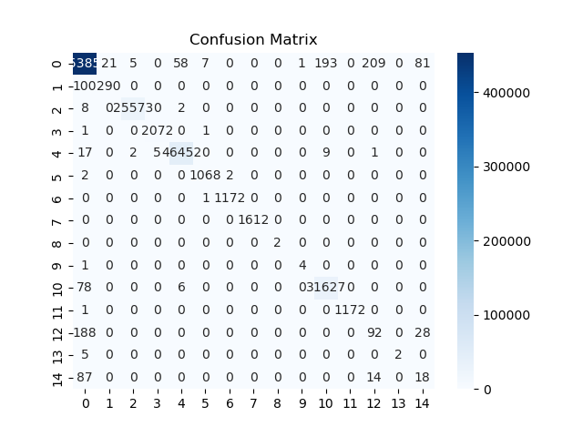

# 基于随机森林的入侵检测系统

## 项目概述

本项目通过使用 **[CICIDS2017]([CIC-IDS2017_数据集-阿里云天池](https://tianchi.aliyun.com/dataset/146744))** 数据集，构建了一个基于机器学习技术的入侵检测系统 (Intrusion Detection System, IDS)。项目的核心是应用机器学习中的 **随机森林** 模型，对网络流量数据进行分类，自动检测出正常流量和多种攻击行为（如 DDoS、PortScan、Web 攻击等）。

## 数据介绍

CICIDS2017数据集包含良性和最新的常见攻击，与真实的现实世界数据（PCAPs）相类似。它还包括使用CICFlowMeter进行网络流量分析的结果，并根据时间戳、源和目的IP、源和目的端口、协议和攻击来标记流量（CSV文件）。此外，还提供了提取的特征定义。 生成真实的背景流量是我们建立这个数据集的首要任务。我们使用了我们提出的B-Profile系统（Sharafaldin, et al. 2016）来描述人类互动的抽象行为并生成自然的良性背景流量。对于这个数据集，我们建立了基于HTTP、HTTPS、FTP、SSH和电子邮件协议的25个用户的抽象行为。

数据采集期从2017年7月3日星期一上午9点开始，到2017年7月7日星期五下午5点结束，共5天。

周一是正常的一天，只包括良性流量。

在星期二、星期三、星期四和星期五的上午和下午实施的攻击包括蛮力FTP、蛮力SSH、DoS、Heartbleed、Web攻击、渗透、Botnet和DDoS。

在我们最近的数据集评估框架中（Gharib等人，2016），我们确定了建立一个可靠的基准数据集所需的11个标准。以前的IDS数据集都无法涵盖这11个标准。在下文中，我们简要概述了这些标准。

完整的网络配置。一个完整的网络拓扑结构包括调制解调器、防火墙、交换机、路由器和各种操作系统，如Windows、Ubuntu和Mac OS X。

完整的流量。通过拥有一个用户分析代理和受害者网络中的12台不同机器以及来自攻击网络的真实攻击。

标记的数据集。第4节和表2显示了每一天的良性和攻击标签。另外，攻击时间的细节将在数据集文件中公布。

完整的交互性。如图1所示，我们通过两个不同的网络和互联网通信覆盖了内部局域网内部和之间。

完整的捕获。因为我们使用的是镜像端口，比如窃听系统，所有的流量都被捕获并记录在存储服务器上。

可用的协议。提供了所有常见的可用协议，如HTTP、HTTPS、FTP、SSH和电子邮件协议的存在。

攻击的多样性。包括基于2016年McAfee报告的最常见的攻击，如该数据集中涵盖的基于Web的攻击、暴力攻击、DoS、DDoS、渗透、心脏出血、机器人和扫描。

异质性。在攻击执行期间，从主交换机和内存转储以及所有受害者机器的系统调用中捕获网络流量。

特征集。使用CICFlowMeter从生成的网络流量中提取了80多个网络流量特征，并将网络流量数据集作为CSV文件交付。参见我们的PCAP分析器和CSV生成器。

元数据。完整地解释了数据集，包括时间，攻击，流量和发表的论文中的标签。

完整的研究论文概述了数据集的细节和其基本原理。

### 项目主要的机器学习内容包括：

1. **数据预处理**：在机器学习建模之前，首先对原始数据进行清洗与标准化处理。我们使用了 **特征缩放** 和 **标签编码** 技术来处理原始数据，使其适合用于模型训练。
2. **特征工程与选择**：通过 **随机森林算法** 的 **特征重要性评分** 方法，自动选择与分类任务最相关的特征。这一步骤不仅提高了模型的精度，还有效降低了模型的计算复杂度。
3. **模型训练**：使用经过特征选择的输入数据，我们构建并训练了 **随机森林模型**。随机森林是一种强大的监督学习算法，能够处理大规模数据并避免过拟合问题。模型训练过程中，使用了 **交叉验证** 和 **超参数调优** 来优化模型性能。
4. **模型评估与解释**：在测试集上评估训练好的模型，并生成包括 **混淆矩阵**、**精确率**、**召回率** 和 **F1-score** 等指标来衡量模型的分类能力。此外，通过可视化 **特征重要性** 和 **分类结果**，帮助理解模型决策过程。

### 机器学习的目标：

本项目的最终目标是利用机器学习技术，开发出一个高效、准确的入侵检测系统，能够识别和分类多种网络攻击行为。这一系统不仅展示了机器学习在网络安全领域的应用潜力，还为进一步的研究和实际部署提供了坚实的基础。

## 项目结构

```bash
ML_IDS_Project/
│
├── data/                                   # 数据文件夹
│   ├── CICIDS2017/                         # 原始数据集
│   │   ├── Friday-WorkingHours-Afternoon-DDos.pcap_ISCX.csv
│   │   ├── Friday-WorkingHours-Afternoon-PortScan.pcap_ISCX.csv
│   │   ├── Friday-WorkingHours-Morning.pcap_ISCX.csv
│   │   ├── Monday-WorkingHours.pcap_ISCX.csv
│   │   ├── Thursday-WorkingHours-Afternoon-Infilteration.pcap_ISCX.csv
│   │   ├── Thursday-WorkingHours-Morning-WebAttacks.pcap_ISCX.csv
│   │   ├── Tuesday-WorkingHours.pcap_ISCX.csv
│   │   ├── Wednesday-workingHours.pcap_ISCX.csv
│   ├── processed/                          # 处理后的数据文件
│   │   └── combined_preprocessed_data.csv  # 预处理后的数据
│   │── feature_importance.csv              # 特征选择结果
│   └── selected_features.csv               # 最终选择的特征列表，用于模型训练的输入数据。
│
├── notebooks/                              # Jupyter notebooks文件夹
│   ├── data_preprocessing.ipynb            # 数据预处理
│   ├── feature_engineering.ipynb           # 特征工程
│   ├── model_training.ipynb                # 模型训练与优化
│   └── model_evaluation.ipynb              # 模型评估与可视化
│
├── scripts/                                # Python脚本文件夹
│   ├── preprocess.py                       # 数据预处理脚本
│   ├── feature_selection.py                # 特征选择与提取脚本
│   ├── train_model.py                      # 模型训练脚本
│   ├── evaluate_model.py                   # 模型评估脚本
│   └── visualize_results.py                # 可视化结果脚本
│
├── reports/                                # 项目报告文件夹
│   ├── project_report.pdf                  # 最终项目报告
│   └── slides.pptx                         # 演示幻灯片
│
├── models/                                 # 模型保存文件夹
│   └── random_forest_model.pkl             # 保存的机器学习模型
│
├── results/                                # 实验结果文件夹
│   ├── confusion_matrix.png                # 混淆矩阵图像
│   ├── feature_importance.png              # 特征重要性图像
│   ├── performance_metrics.csv             # 模型评估结果
│   ├── classification_report.csv           # 分类报告
│   ├── confusion_matrix.csv                #分类报告
│   └── precision_by_class.png              #可视化的精确率条形图
│
├── README.md                               # 项目说明文档
├── requirements.txt                        # 项目依赖文件
└── main.py                                 # 项目入口脚本
```

## 依赖项安装

在运行本项目之前，请确保已经安装了所有必要的 Python 库。可以使用以下命令安装项目依赖项：

```bash
pip install -r requirements.txt
```

`requirements.txt` 文件包含了项目所需的主要依赖库：

```makefile
pandas==1.3.3          # 用于数据操作和分析
scikit-learn==0.24.2   # 机器学习库，包含模型训练、评估和特征选择
matplotlib==3.4.3      # 用于数据可视化的图表绘制
seaborn==0.11.2        # 数据可视化库，绘制统计图
joblib==1.0.1          # 用于模型的保存与加载
```

## 运行步骤

按照以下顺序运行脚本，以完成整个入侵检测流程：

### 方式一：通过 Python 脚本运行项目

项目中的 Python 脚本提供了一个自动化的流程，按照以下步骤运行整个项目：

1. #### 数据预处理 (preprocess.py)

  该脚本的主要目的是对原始数据进行清洗、标准化和标签编码等预处理步骤，以便后续机器学习模型的训练和评估。我们将逐步介绍代码的每个部分及其具体功能。

运行方式：

```bash
python scripts/preprocess.py
```

1. #####  **加载和合并多个 CSV 文件**

   ```python
   def load_and_merge_csv(folder_path):
       # 获取文件夹中所有CSV文件的路径
       csv_files = [f for f in os.listdir(folder_path) if f.endswith('.csv')]
   
       # 初始化一个空的DataFrame
       combined_data = pd.DataFrame()
   
       # 依次读取每个CSV文件并进行合并
       for file in csv_files:
           file_path = os.path.join(folder_path, file)
           print(f"正在读取文件: {file}")
           data = pd.read_csv(file_path)
   
           # 去除列名中的空格
           data.columns = data.columns.str.strip()
   
           print(f"文件 {file} 的列名: {data.columns.tolist()}")
           combined_data = pd.concat([combined_data, data], ignore_index=True)
   
       return combined_data
   
   ```

   **作用**：

   1. 从指定文件夹中逐个读取所有 `.csv` 文件，并合并为一个大型 DataFrame。
   2. 通过 `os.listdir` 获取所有文件路径，确保数据能够被正确导入。
   3. 使用 `pd.concat` 逐个合并文件，合并后形成一个完整的数据集，便于后续操作。

2. ##### 处理缺失值

   ```python
   def handle_missing_values(data):
       # 填充缺失值为0或使用中位数等方法
       data = data.fillna(0)
       return data
   ```

   **作用**：

   - 使用 `fillna(0)` 方法将所有缺失值填充为 0。这确保数据集中不会有缺失值影响模型的训练或测试。

3. ##### 处理无效值（如无穷大）

   ```python
   def handle_invalid_values(data):
       # 将无穷大值替换为NaN，然后使用0填充NaN
       data = data.replace([float('inf'), float('-inf')], float('nan'))
       data = data.fillna(0)  # 你也可以使用其他方式填充，如data.fillna(data.mean())
       return data
   ```

   **作用**：

   - 数据中如果存在无穷大的值（如除零错误导致的 `inf` 值），这些值会被替换为 NaN。然后再将这些 NaN 值填充为 0，确保所有数值都有效。
   - 如果想要更精确的处理方式，可以替换为其他填充策略，如填充均值或中位数。

4. ##### 标签编码

   ```python
   def encode_labels(data, label_column='Label'):
       if label_column in data.columns:
           label_encoder = LabelEncoder()
           data[label_column] = label_encoder.fit_transform(data[label_column])
           print(f"已对标签 '{label_column}' 进行编码。")
           return data, label_encoder
       else:
           print(f"警告：数据中没有找到 '{label_column}' 列，跳过标签编码。")
           return data, None
   ```

   **作用**：

   - 使用 `LabelEncoder` 将数据中的标签列进行编码。具体来说，将类别标签转换为数值格式，使其符合机器学习模型的输入要求。
   - 例如，"BENIGN" 可能被编码为 0，其他攻击类型被编码为不同的数值。
   - 标签编码是分类任务中的关键一步，如果没有标签列，程序将跳过后续的处理。

5. ##### 特征标准化

   ```python
   def scale_features(data, feature_columns):
       scaler = StandardScaler()
       data[feature_columns] = scaler.fit_transform(data[feature_columns])
       return data, scaler
   
   ```

   **作用**：

   - 使用 `StandardScaler` 对特征进行标准化。标准化后，所有特征将具有相同的量级（均值为 0，标准差为 1），这有助于模型的快速收敛和准确性提升。
   - 特征标准化是处理网络流量数据的一个常用步骤，因为不同特征可能具有不同的量纲（如字节数与时间戳）。

6. ##### 数据分割

   ```python
   def split_data(data, label_column='Label', test_size=0.2):
       X = data.drop(columns=[label_column])
       y = data[label_column]
       X_train, X_test, y_train, y_test = train_test_split(X, y, test_size=test_size, random_state=42)
       return X_train, X_test, y_train, y_test
   ```

   **作用**：

   - 通过 `train_test_split` 将数据集分割为训练集和测试集。`test_size=0.2` 表示 20% 的数据用于测试，80% 用于训练。
   - `random_state=42` 保证分割的随机性具有可复现性，确保每次运行的分割结果一致。
   - 分割数据集的目的是为了对模型进行性能评估，测试集用于评估模型在未见过的数据上的表现。

7. ##### 主程序

   ```python
   if __name__ == "__main__":
       # 加载并合并数据集
       folder_path = '../data/CICIDS2017/'  # 使用相对路径，确保该路径正确指向CSV文件夹
       combined_data = load_and_merge_csv(folder_path)
   
       # 处理缺失值
       combined_data = handle_missing_values(combined_data)
   
       # 处理无效值（如无穷大）
       combined_data = handle_invalid_values(combined_data)
   
       # 提取特征列（假设最后一列是标签列，需检查数据是否一致）
       feature_columns = combined_data.columns[:-1]  # 忽略标签列
   
       # 标签编码
       combined_data, label_encoder = encode_labels(combined_data)
   
       # 如果存在 'Label' 列则继续处理
       if label_encoder is not None:
           # 特征标准化
           combined_data, scaler = scale_features(combined_data, feature_columns)
   
           # 分割数据集为训练集和测试集
           X_train, X_test, y_train, y_test = split_data(combined_data)
   
           # 保存处理后的数据（可选）
           combined_data.to_csv('../data/processed/combined_preprocessed_data.csv', index=False)
           print("数据预处理完成并保存！")
       else:
           print("由于缺少 'Label' 列，跳过预处理。")
   
   ```

   **作用**：

   - 首先，程序会从指定路径加载所有 CSV 文件，并将它们合并成一个数据集。
   - 然后对数据进行清洗，包括处理缺失值和无效值，确保数据质量。
   - 对标签列进行编码，并标准化特征，最后将数据集分割为训练集和测试集，并将预处理后的数据保存到指定路径。


2. #### 特征选择 (feature_selection.py)

  该脚本使用 **随机森林** 模型进行特征选择，基于模型的特征重要性评分，筛选出最重要的特征。这些特征将作为后续模型训练的输入。以下是脚本的详细流程：

运行方式：

```bash
python scripts/feature_selection.py
```

1. ##### **加载数据**

   ```python
   def load_data(file_path):
       data = pd.read_csv(file_path)
       return data
   ```

   **作用**：

   - 使用 `pandas` 读取已预处理的数据集。该数据文件 (`combined_preprocessed_data.csv`) 是通过前面的数据预处理步骤生成的，包含了所有的特征和标签列。
   - 数据加载后被存储为 `pandas.DataFrame`，便于后续的特征选择操作。

2. #####  **随机森林模型进行特征选择**

   ```python
   def feature_selection(X_train, y_train):
       rf_model = RandomForestClassifier(n_estimators=100, random_state=42, n_jobs=-1)
       rf_model.fit(X_train, y_train)
   
       selector = SelectFromModel(rf_model, prefit=True)
       selected_features = selector.get_support(indices=True)
   
       return selected_features
   ```

   **作用**：

   - **随机森林模型训练**：使用 `RandomForestClassifier` 来训练模型。`n_estimators=100` 表示使用 100 棵树构建森林，`n_jobs=-1` 允许使用所有 CPU 核心以加速模型训练。随机森林是一种强大的特征选择工具，它能够基于每棵树对数据的划分，计算每个特征的重要性。
   - **特征选择**：训练完成后，使用 `SelectFromModel` 类选择最重要的特征。该方法会基于模型的特征重要性评分，自动选择与分类任务相关性最强的特征。
   - **返回特征索引**：通过 `get_support(indices=True)`，返回被选择的特征的索引，供后续使用。

3. ##### 主程序

   ```python
   if __name__ == "__main__":
       # 加载数据
       file_path = '../data/processed/combined_preprocessed_data.csv'
       data = load_data(file_path)
   
       # 分离特征和标签
       X = data.drop(columns=['Label'])
       y = data['Label']
   
       # 特征选择
       selected_features = feature_selection(X, y)
   
       # 保存选中的特征
       pd.DataFrame(selected_features).to_csv('../data/selected_features.csv', index=False)
   ```

   **作用**：

   - **加载数据**：脚本从 `../data/processed/combined_preprocessed_data.csv` 加载预处理好的数据集，其中包含所有特征和标签列。
   - **分离特征与标签**：将数据集的特征和标签分开，`X` 为特征，`y` 为标签（"Label" 列）。标签列用于指导模型分类，而特征列用于模型训练和特征选择。
   - **执行特征选择**：调用 `feature_selection(X, y)` 函数，使用训练好的随机森林模型进行特征选择，筛选出最重要的特征。
   - **保存特征选择结果**：将被选中的特征索引保存为 `../data/selected_features.csv` 文件，供后续模型训练使用。

3. #### 模型训练 (train_model.py)

  该脚本使用 **随机森林** 模型对处理后的数据进行训练，并将训练好的模型保存到本地文件中，供后续使用。以下是详细的执行步骤与代码说明：

运行方式：

```bash
python scripts/train_model.py
```

1. ##### **加载数据**

   ```python
   def load_data(file_path):
       data = pd.read_csv(file_path)
       return data
   
   ```

   **作用**：

   - 使用 `pandas` 读取预处理好的数据文件，该文件通过前一步的数据预处理和特征选择生成，包含了所有特征和标签列。
   - 数据加载后被存储为 `pandas.DataFrame`，便于后续的模型训练操作。

2. ##### 加载特征选择结果

   ```python
   selected_features = pd.read_csv('../data/selected_features.csv').values.flatten()
   ```

   **作用**：

   - 读取前一步特征选择 (`feature_selection.py`) 的输出结果。该结果是已筛选出的最重要的特征的索引，保存在 `selected_features.csv` 文件中。将这些特征索引用于模型训练，有助于提升模型的训练速度和性能。

3. ##### 分离特征与标签

   ```python
   X = data.iloc[:, selected_features]
   y = data['Label']
   ```

   **作用**：

   - 通过 `iloc` 根据索引筛选出被选择的特征列 (`X`)，并将标签列 (`Label`) 单独提取为目标变量 (`y`)。模型将在这些特征和标签上进行训练。

4. ##### 分割数据集

   ```python
   X_train, X_test, y_train, y_test = train_test_split(X, y, test_size=0.2, random_state=42)
   
   ```

   **作用**：

   - 使用 `train_test_split` 将数据集划分为训练集和测试集。测试集占总数据集的 20%（`test_size=0.2`），剩余的 80% 用于模型训练。`random_state=42` 确保分割的随机性可复现。这样分割数据集有助于在模型训练后进行评估，以衡量模型在未见过的数据上的表现。

5. ##### 训练随机森林模型

   ```python
   model = RandomForestClassifier(random_state=42, n_jobs=-1)
   model.fit(X_train, y_train)
   
   ```

   **作用**：

   - **随机森林模型**：`RandomForestClassifier` 是一种常用的集成学习方法，利用多个决策树的组合来完成分类任务。`random_state=42` 确保结果可复现，`n_jobs=-1` 允许使用所有 CPU 核心并行计算以加速训练。
   - **模型训练**：调用 `fit(X_train, y_train)` 函数，模型将根据训练集中的数据学习如何进行分类。

6. ##### 保存模型

   ```python
   joblib.dump(model, '../models/random_forest_model.pkl')
   
   ```

   **作用**：

   - 使用 `joblib` 将训练好的随机森林模型保存到指定文件中 (`random_forest_model.pkl`)。保存模型可以让后续步骤直接加载和使用已训练的模型，而无需每次都重新训练模型。这在大规模数据集上尤为重要，因为训练过程可能非常耗时。

**作用**：

- 使用 `joblib` 将训练好的随机森林模型保存到指定文件中 (`random_forest_model.pkl`)。保存模型可以让后续步骤直接加载和使用已训练的模型，而无需每次都重新训练模型。这在大规模数据集上尤为重要，因为训练过程可能非常耗时。

4. #### 模型评估 (evaluate_model.py)

  该脚本用于加载已经训练好的模型，并在测试集上进行评估，生成分类报告和混淆矩阵，最后保存评估结果。下面是详细的代码流程和说明：

运行方式：

```bash
python scripts/evaluate_model.py
```

1. ##### **加载模型**

   ```python
   def load_model(model_path):
       model = joblib.load(model_path)
       return model
   
   ```

   **作用**：

   - 使用 `joblib` 加载训练好的模型。该模型之前已经保存为 `.pkl` 文件，包含了随机森林模型的所有训练结果。加载后，模型可以直接用于预测而无需重新训练。

2. ##### 加载预处理后的数据

   ```python
   def load_preprocessed_data(file_path):
       data = pd.read_csv(file_path)
       return data
   
   ```

   **作用**：

   - 使用 `pandas` 读取预处理后的数据集，这个数据集是通过之前的数据预处理和特征选择步骤生成的。数据集包含了用于模型评估的特征和标签列。

3. ##### 加载数据与特征选择结果

   ```python
   file_path = '../data/processed/combined_preprocessed_data.csv'
   data = load_preprocessed_data(file_path)
   
   # 加载选择的特征
   selected_features = pd.read_csv('../data/selected_features.csv').values.flatten()
   
   ```

   **作用**：

   - 读取预处理好的数据，并加载之前通过 `feature_selection.py` 生成的特征选择结果 (`selected_features.csv`)。这些被选择的特征将用于评估模型。

4. ##### 分离特征与标签

   ```python
   X = data.iloc[:, selected_features]  # 使用选择的特征
   y = data['Label']  # 标签列
   
   ```

   **作用**：

   - 将数据集中选择好的特征提取出来作为模型的输入特征 (`X`)，同时将标签列 (`Label`) 作为目标变量 (`y`) 用于评估模型的表现。

5. ##### 分割数据集

   ```python
   X_train, X_test, y_train, y_test = train_test_split(X, y, test_size=0.2, random_state=42)
   
   ```

   **作用**：

   - 使用 `train_test_split` 将数据集划分为训练集和测试集。虽然模型已经训练好，但为了评估模型的表现，我们需要通过测试集来验证其效果。

6. ##### 模型预测

   ```python
   y_pred = model.predict(X_test)
   ```

   **作用**：

   - 加载的随机森林模型对测试集数据进行预测，`y_pred` 保存了模型的预测结果。接下来将对这些预测结果进行评估。

7. #####  **生成混淆矩阵和分类报告**

   ```python
   cm = confusion_matrix(y_test, y_pred)
   report = classification_report(y_test, y_pred, output_dict=True)
   ```

   **作用**：

   - **混淆矩阵**：`confusion_matrix` 用于计算模型的分类结果，它展示了模型的准确分类和错误分类的数量。混淆矩阵对理解分类器的性能非常有帮助。
   - **分类报告**：`classification_report` 生成更详细的评估结果，包括精确率 (precision)、召回率 (recall)、F1-score 以及各类别的支持数 (support)。这些指标能够帮助你全面了解模型的分类表现。

8. ##### 保存评估结果

```python
pd.DataFrame(cm).to_csv('../results/confusion_matrix.csv', index=False)
pd.DataFrame(report).transpose().to_csv('../results/classification_report.csv', index=True)

```

**作用**：

- 将生成的混淆矩阵和分类报告保存为 CSV 文件，便于后续分析和可视化。

通过该脚本，我们可以评估训练好的随机森林模型在测试集上的表现，生成混淆矩阵和分类报告，最后将这些结果保存下来。

5. #### 结果可视化 (visualize_results.py)

  该脚本的作用是将模型评估结果（如混淆矩阵和分类报告）以可视化的方式呈现，便于理解模型的分类效果。以下是具体的步骤和解释：

运行方式：

```bash
python scripts/visualize_results.py
```

1. ##### **绘制混淆矩阵**

   ```python
   def plot_confusion_matrix(file_path):
       cm = pd.read_csv(file_path)
       sns.heatmap(cm, annot=True, fmt='d', cmap='Blues')
       plt.title("Confusion Matrix")
       plt.savefig('../results/confusion_matrix.png')
       plt.show()
   
   ```

   **作用**：

   - **读取混淆矩阵数据**：从 CSV 文件中读取之前生成的混淆矩阵数据，并使用 `pandas` 将其加载为 DataFrame 对象。
   - **可视化**：使用 `seaborn` 的 `heatmap` 函数绘制混淆矩阵。`annot=True` 表示在图表中显示具体的数值，`cmap='Blues'` 设置颜色为蓝色渐变。这个热力图可以直观展示模型在不同类别上的预测效果。
   - **保存和显示**：生成的混淆矩阵图保存为 `confusion_matrix.png` 文件，并立即展示。

2. #####  **绘制分类报告的条形图**

   ```python
   def plot_classification_report(file_path):
       # 加载分类报告
       report_df = pd.read_csv(file_path)
   
       # 打印数据以检查文件内容
       print(report_df)
   
       # 使用适当的列名，根据实际数据结构设置
       report_df.columns = ['class', 'precision', 'recall', 'f1-score', 'support']
   
       # 过滤掉非数字类行（如 accuracy, macro avg 等）
       filtered_df = report_df[~report_df['class'].isin(['accuracy', 'macro avg', 'weighted avg'])]
   
       # 可视化 precision 列
       plt.figure(figsize=(10, 6))
       sns.barplot(x=filtered_df['class'], y=filtered_df['precision'].astype(float))
       plt.title('Precision by Class')
       plt.xticks(rotation=90)
       plt.savefig('../results/precision_by_class.png')
       plt.show()
   
   ```

   **作用**：

   - **加载分类报告**：从 CSV 文件中读取分类报告，该报告包含了模型对每个类别的精确率、召回率、F1-score 等指标。
   - **过滤数据**：在报告中，有一些非具体类别的行（如 accuracy、macro avg 等），这些行可以通过过滤掉不需要的类别来简化数据。`filtered_df` 保留了各个类别的具体评估结果。
   - **条形图可视化**：使用 `seaborn` 绘制精确率的条形图，展示模型在不同类别上的分类精确度。条形图可以直观比较模型在各类别上的表现。
   - **保存和显示**：将生成的精确率图保存为 `precision_by_class.png` 文件，并展示该图。

3. ##### 主程序

```python
if __name__ == "__main__":
    # 加载并可视化混淆矩阵
    plot_confusion_matrix('../results/confusion_matrix.csv')

    # 加载并可视化分类报告
    plot_classification_report('../results/classification_report.csv')

```

**作用**：

- **调用可视化函数**：主程序将依次调用前面定义的两个函数，生成混淆矩阵和分类报告的可视化图表。通过读取存储的 CSV 文件，将评估结果以图表的方式展示，便于后续分析和展示。

### 方式二：通过ipynb脚本运行项目

除了使用 Python 脚本，项目中的每个步骤也可以通过 Jupyter Notebook 逐步执行。这种方式可以更方便地查看中间结果、进行可视化、并且可以在每一步进行交互操作。以下是每个 Notebook 文件的详细作用及其对应的步骤：

1. #### **数据预处理 (`data_preprocessing.ipynb`)**

   在这个 Notebook 中，主要负责对原始数据进行预处理。步骤包括加载数据、处理缺失值、处理无效值、标签编码、特征标准化以及数据保存。以下是 Notebook 的执行步骤：

   - **加载并合并多个 CSV 文件**：首先，使用 `load_and_merge_csv()` 函数，逐个加载并合并多个 `.csv` 文件。合并后的数据将作为后续处理的基础。
   - **处理缺失值与无效值**：对加载的数据进行清理，填补缺失值，处理无效值（如无穷大），确保数据的完整性和有效性。
   - **标签编码**：对分类任务中的标签列（如 "Label"）进行编码，使其适合模型使用。
   - **特征标准化**：对数据中的数值特征进行标准化，使不同特征的数值范围一致。
   - **保存预处理后的数据**：将最终预处理后的数据保存到文件中。

   通过 Notebook 运行这些步骤，用户可以实时检查数据的变化，并可视化中间结果，如数据的分布和统计信息。

2. #### 特征工程 (`feature_engineering.ipynb`)

   这个 Notebook 负责使用随机森林模型进行特征选择，并保存选中的特征列表。具体步骤如下：

   - **加载预处理后的数据**：使用 `pandas` 加载之前生成的预处理数据文件。
   - **分离特征与标签**：将特征和标签列分离开来。
   - **训练随机森林模型进行特征选择**：使用 `RandomForestClassifier` 对数据进行训练，并基于特征重要性筛选出最相关的特征。
   - **保存选中的特征**：将筛选出的特征保存为 CSV 文件，供模型训练时使用。

   在 Notebook 中，用户可以动态调试模型，查看每个特征的重要性，并决定是否调整特征选择的阈值。

3. #### 模型训练与优化 (`model_training.ipynb`)

   这个 Notebook 负责对选择好的特征进行模型训练。步骤如下：

   - **加载数据和特征选择结果**：使用 `pandas` 加载预处理后的数据以及特征选择的结果。
   - **分割数据集**：将数据集划分为训练集和测试集，以便评估模型的泛化能力。
   - **训练随机森林模型**：使用 `RandomForestClassifier` 对训练集进行训练，生成最终的分类模型。
   - **超参数调优**：可以在 Notebook 中动态调整模型的参数（如 `n_estimators` 或 `max_depth`），并实时查看模型性能的变化。
   - **保存模型**：将训练好的模型保存为 `.pkl` 文件，以便在后续步骤中进行评估和推理。

   通过 Notebook，用户可以灵活地调整模型参数，并且可以直观地查看模型在训练集和测试集上的表现。

4. #### 模型评估与可视化 (`model_evaluation.ipynb`)

   该 Notebook 主要负责加载训练好的模型，并在测试集上进行评估。具体步骤如下：

   - **加载预处理后的数据和模型**：从文件中加载预处理的数据集和之前保存的模型。
   - **分割数据集**：将数据集划分为训练集和测试集，以便评估模型的泛化能力。
   - **模型预测**：使用加载的模型对测试集进行预测，并生成预测结果。
   - **生成评估指标**：计算模型的性能指标，包括混淆矩阵、分类报告（精确率、召回率、F1-score 等）。
   - **可视化评估结果**：将混淆矩阵和分类报告以图表的形式展示出来，便于进一步分析。

   通过 Notebook，可以实时查看模型的分类效果，并动态生成图表，如混淆矩阵和分类报告的可视化结果。

### 实验结果文件说明

以下是实验中生成的结果文件及其用途：

- **`confusion_matrix.png`**：这是模型的混淆矩阵图像，用于展示模型在每个类别上的预测结果与真实结果之间的对应关系。通过观察混淆矩阵，你可以了解模型在哪些类别上表现较好，以及在哪些类别之间存在较多的混淆。

  

- **`feature_importance.png`**：该图像展示了模型的特征重要性，说明了哪些特征对模型的决策有着较大的影响。特征重要性帮助你了解哪些输入变量对模型的预测贡献最大，有助于解释模型的行为。

  

- **`performance_metrics.csv`**：这是模型整体评估结果的文件，包含了如准确率（accuracy）、精确率（precision）、召回率（recall）和 F1-score 等关键指标，帮助量化模型的性能。

   [performance_metrics.csv](..\results\performance_metrics.csv) 

- **`classification_report.csv`**：分类报告文件，提供了每个类别的详细评估指标，包括精确率、召回率、F1-score 和支持度。这份报告有助于深入分析模型在各类别上的表现。

   [classification_report.csv](..\results\classification_report.csv) 

- **`confusion_matrix.csv`**：这是混淆矩阵的 CSV 文件，与 `confusion_matrix.png` 图像内容相同，但以表格形式呈现。该文件方便你进一步进行数据分析或将数据导入其他工具中进行处理。

   [confusion_matrix.csv](..\results\confusion_matrix.csv) 

- **`precision_by_class.png`**：这是按类别展示的精确率条形图，通过图像可以直观了解模型在每个类别上的分类精确率，帮助你快速定位模型在哪些类别上表现更好，哪些类别可能需要进一步优化。

  
